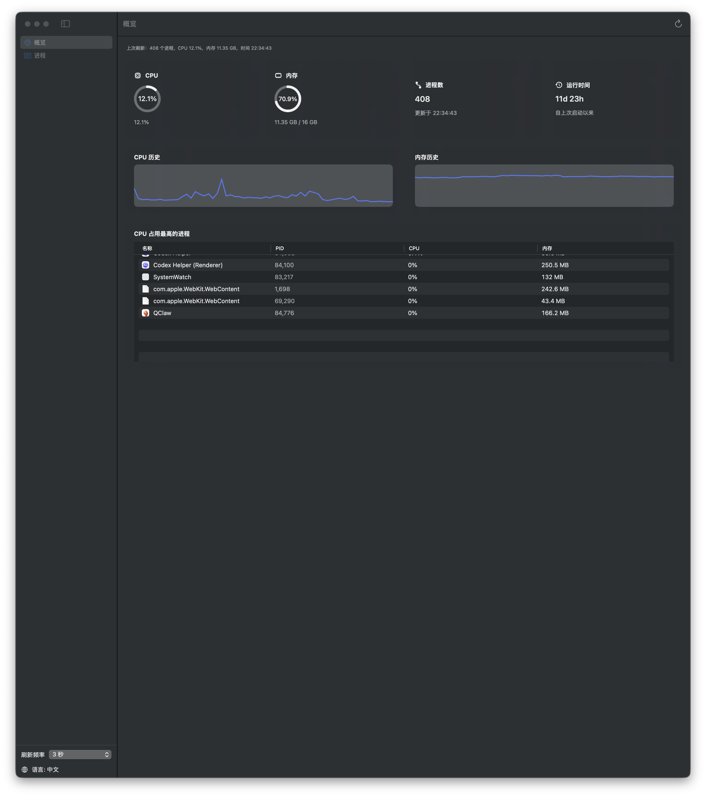
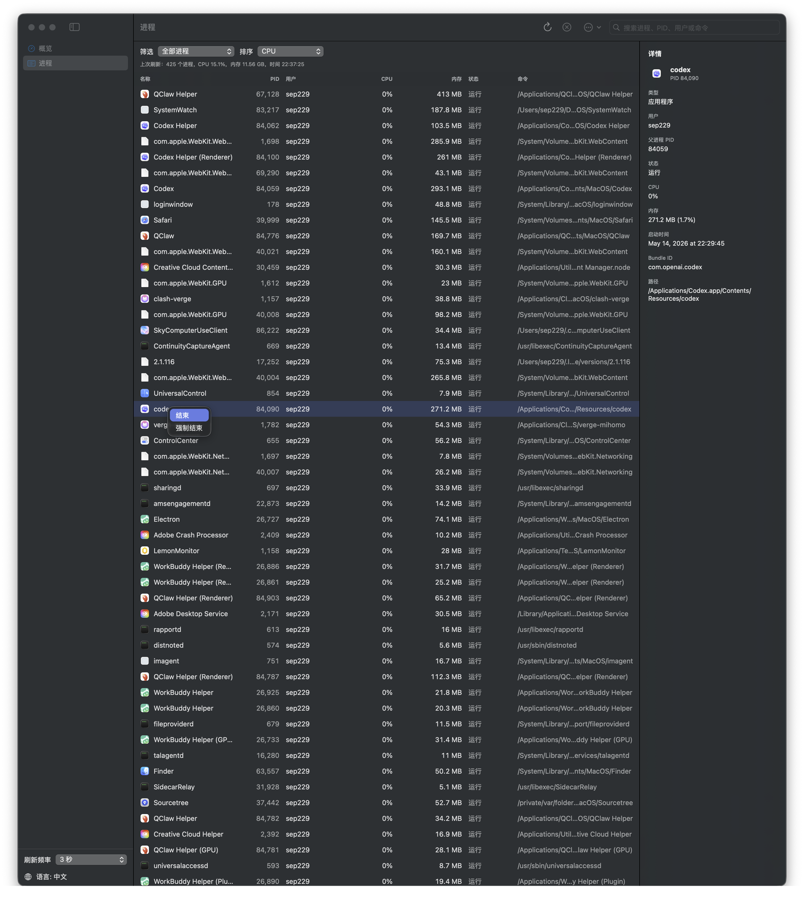
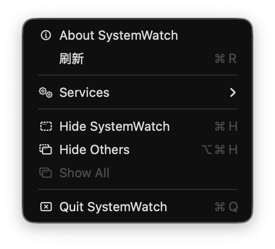

# SystemWatch

SystemWatch 是一个原生 macOS 系统监视器，灵感来自 Windows 任务管理器。它可以查看系统运行状态、进程列表、进程详情，并提供搜索、筛选、排序、右键结束进程、菜单栏状态显示和中英文切换。

English documentation is available below: [English](#english)

## 功能特性

- 实时显示 CPU、内存、进程数和系统运行时间
- CPU / 内存历史曲线
- 进程列表支持应用图标、搜索、排序和筛选
- 进程详情面板显示 PID、父进程 PID、用户、状态、内存、启动时间、Bundle ID 和路径
- 支持右键结束进程或强制结束进程
- 对 SystemWatch 自身和关键系统进程做了安全保护
- 菜单栏状态项显示 CPU 和内存摘要
- 刷新频率可选：1 秒、3 秒、5 秒或暂停
- 内置中文和英文界面切换
- 提供终端诊断模式，便于排查系统采样问题

## 截图

### 概览



### 进程列表



### 菜单栏状态



## 环境要求

- macOS 14 或更新版本
- Xcode Command Line Tools
- Swift 5.9 兼容工具链

## 构建和运行

```bash
cd "/Users/sep229/Documents/New project"
./script/build_and_run.sh
```

常用模式：

```bash
./script/build_and_run.sh --foreground
./script/build_and_run.sh --diagnose
./script/build_and_run.sh --diagnose-snapshot
```

说明：

- `--foreground`：直接以前台方式运行 app 二进制，并在终端输出刷新诊断信息
- `--diagnose`：检查基础系统采样能力
- `--diagnose-snapshot`：走完整的 SystemWatch 采样路径并输出进程、CPU、内存诊断

## 打包发布

创建 release 构建和 zip 包：

```bash
cd "/Users/sep229/Documents/New project"
./script/package_release.sh
```

脚本会生成：

- `dist/release/SystemWatch.app`
- `dist/release/SystemWatch-macOS.zip`

当前脚本使用 ad-hoc 签名，适合本地测试或个人分发。如果要公开发布，建议使用 Developer ID 证书签名并进行 notarization。

## GitHub Release 建议流程

1. 运行发布脚本：

   ```bash
   ./script/package_release.sh
   ```

2. 确认截图位于 `docs/screenshots/`。
3. 提交 README、脚本和截图更新。
4. 在 GitHub 创建 Release，并上传 `dist/release/SystemWatch-macOS.zip`。

## 注意事项

SystemWatch 使用 macOS 原生 API，例如 `proc_listpids`、`proc_pidinfo`、`host_processor_info` 和 `host_statistics64`。即使如此，macOS 仍可能拒绝结束受保护进程、其他用户进程或关键系统进程。

---

## English

SystemWatch is a native macOS system monitor inspired by Task Manager. It shows live system status, process details, filtering and sorting controls, right-click process actions, a menu bar status item, and built-in Chinese / English switching.

## Features

- Live CPU, memory, process count, and uptime overview
- CPU and memory history charts
- Process list with application icons, search, sorting, and filters
- Process detail panel with PID, parent PID, user, state, memory, start time, Bundle ID, and path
- Right-click process actions for ending or force quitting a process
- Safer termination rules for SystemWatch itself and critical system processes
- Menu bar status item with CPU and memory summary
- Refresh rate control: 1 second, 3 seconds, 5 seconds, or paused
- Built-in Chinese and English UI switching
- Terminal diagnostics for troubleshooting process and system sampling

## Screenshots

### Overview


### Processes


### Menu Bar


## Requirements

- macOS 14 or newer
- Xcode Command Line Tools
- Swift 5.9 compatible toolchain

## Build and Run

```bash
cd "/Users/sep229/Documents/New project"
./script/build_and_run.sh
```

Useful modes:

```bash
./script/build_and_run.sh --foreground
./script/build_and_run.sh --diagnose
./script/build_and_run.sh --diagnose-snapshot
```

`--foreground` runs the app binary directly and prints refresh diagnostics to the terminal.

## Release Package

Create a release build and zip package:

```bash
cd "/Users/sep229/Documents/New project"
./script/package_release.sh
```

The script writes:

- `dist/release/SystemWatch.app`
- `dist/release/SystemWatch-macOS.zip`

The package uses ad-hoc signing for local distribution. For public distribution, use a Developer ID certificate and notarization.

## GitHub Release Checklist

1. Build the release package:

   ```bash
   ./script/package_release.sh
   ```

2. Confirm screenshots are available in `docs/screenshots/`.
3. Commit the updated README, scripts, and screenshots.
4. Create a GitHub release and upload `dist/release/SystemWatch-macOS.zip`.

## Notes

SystemWatch uses macOS-native APIs such as `proc_listpids`, `proc_pidinfo`, `host_processor_info`, and `host_statistics64`. macOS may still refuse termination requests for protected, other-user, or critical system processes.
